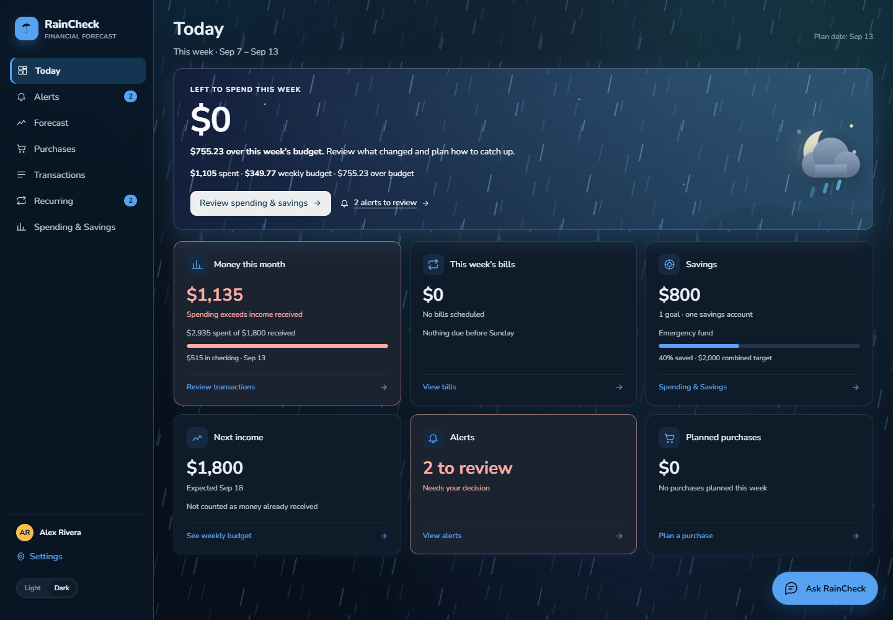
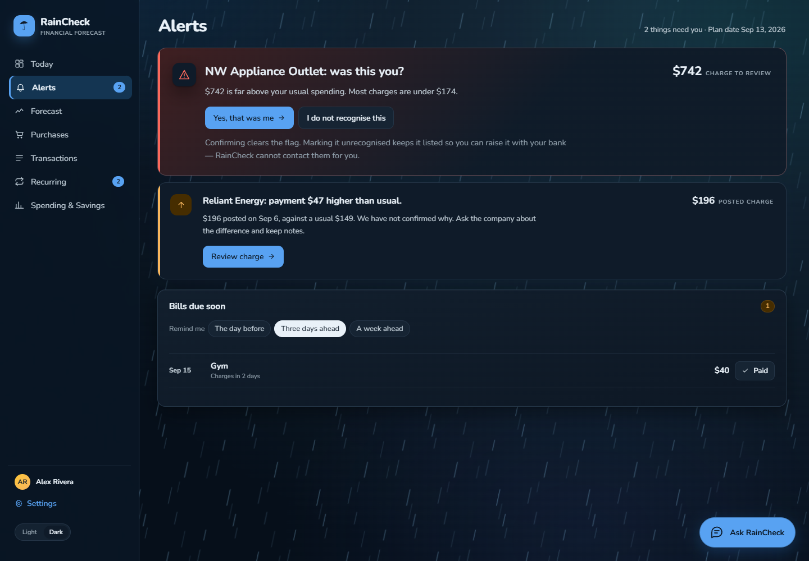
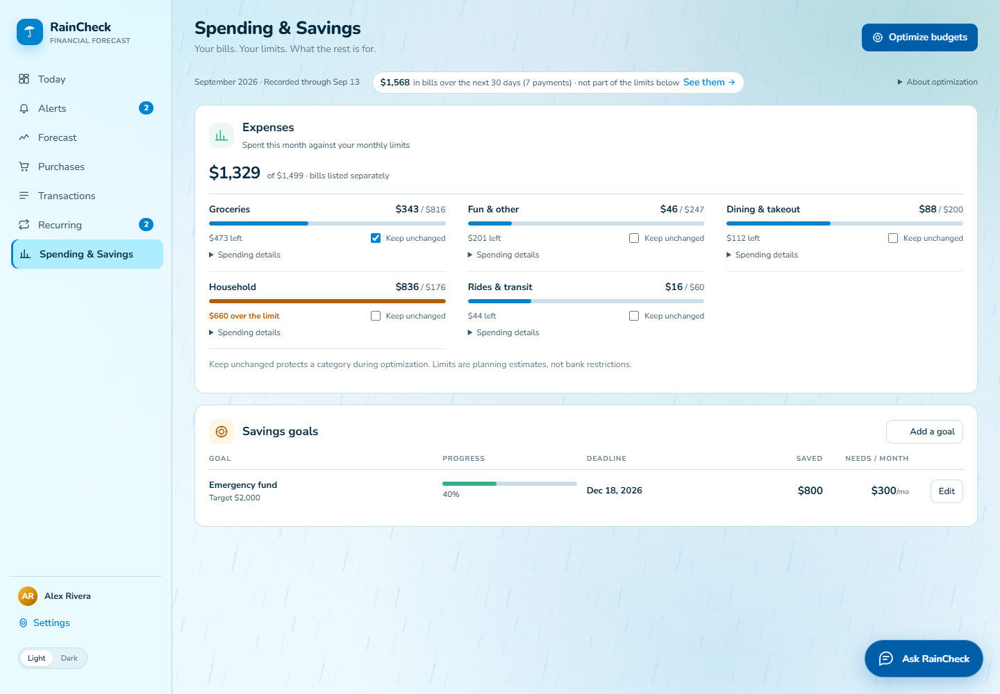
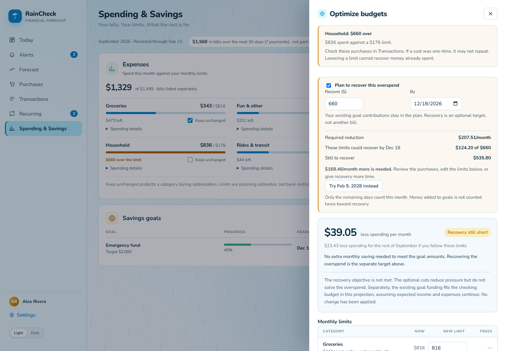
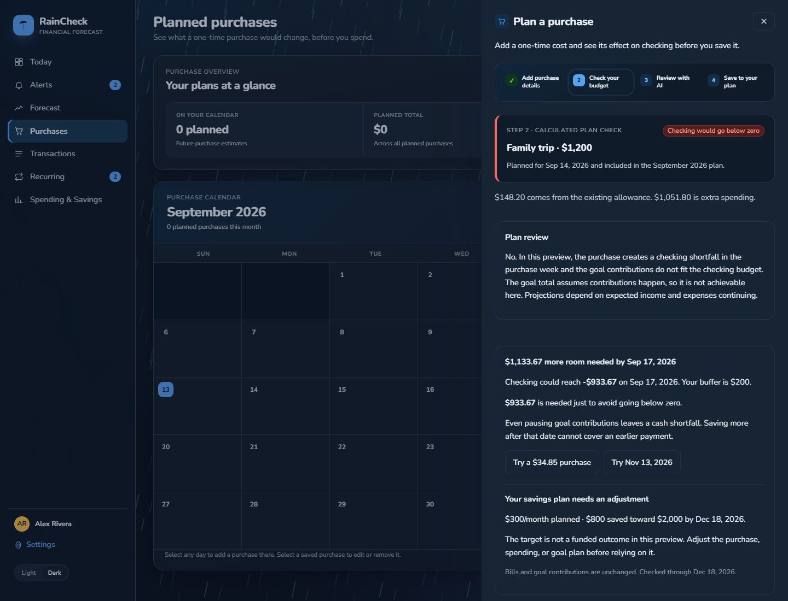
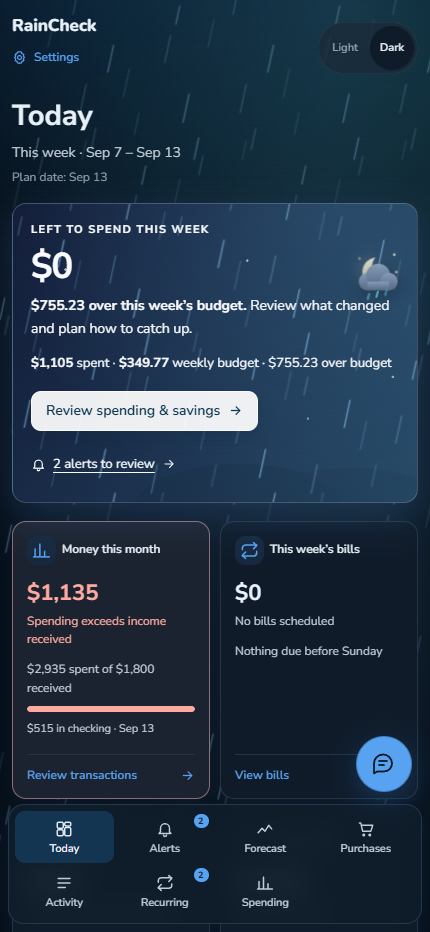
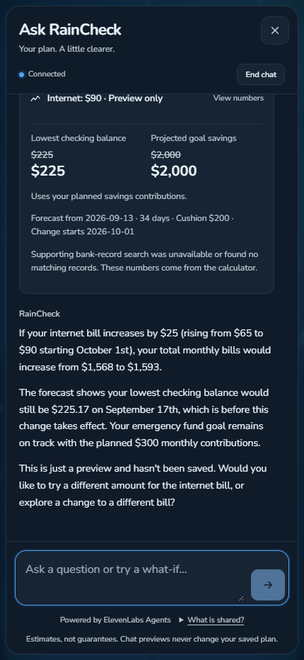

# RainCheck

A weather-themed planner connecting everyday spending, upcoming bills, planned purchases, and savings goals.

**[Open the live demo](https://raincheck-planner.vercel.app/)** · Built for HackRice 16



## Explore the app

- **Today:** this week's spending room, bills, income, and shared savings progress. Rain signals budget pressure or unresolved alerts. Light and dark modes show the same numbers.
- **Alerts:** specific unusual charges and recurring-bill differences. General weekly overspending stays on Today and Spending & Savings instead of becoming a duplicate alert.
- **Forecast:** compare recorded months with a selected month's estimate, including category spending, scheduled bills, and planned one-time costs.
- **Spending & Savings:** category limits, protected expenses, and multiple savings goals checked against one combined budget. **Optimize budgets** explains proposed changes and how much of an overspend they recover. Edit and confirm before applying.
- **Purchases:** enter a cost and date, check the cash needed before payment, and read an AI explanation. Try a smaller cost or later payday when the calculation supports it. Save, edit, or remove explicitly.
- **Ask RainCheck:** type directly into the floating chat. ElevenLabs Agents can explain calculations and preview changes, but cannot accept a plan or move money.

## Judge walkthrough

1. Open **Today**, switch Light/Dark, and inspect the highlighted spending gap.
2. Open **Alerts**. Review an unfamiliar purchase or a recurring charge difference. Bank records show what changed, not why a company charged it.
3. Open **Spending & Savings → Optimize budgets**. Wait for analysis, edit the limits, and compare the recovery amount with the unresolved gap.
4. Open **Purchases → Plan a purchase**. Try a cost before the next payday. Compare the calculated shortfall and available alternatives before saving.
5. Ask the chatbot, “What if my internet bill increases by $25?” Its explanation should agree with the calculated preview.

**Use fictional details only.** This is a shared mock household. Public demo purchases are visible to teammates and other visitors. Most other decisions stay in your browser. Local and hosted purchases share records when configured for the same household and demo session.

Demo controls live under **Settings**. Resetting browser decisions does not undo shared purchases or bank records. No real bank transfer is needed for this walkthrough.

## Screenshots

Captured with Playwright on desktop and phone layouts. These use a connected mock household; its dates and totals can differ from the bundled sample.

<details>
<summary>Alerts and Spending & Savings</summary>





</details>

<details>
<summary>Purchase analysis and mobile chat</summary>





</details>

## Run locally

Requires **Node.js 24+**.

```bash
npm ci
npm run dev
```

Open [http://127.0.0.1:5176](http://127.0.0.1:5176). Vite also serves the `api/` handlers. The bundled sample supports browsing and calculations without credentials; cloud review, chat, and shared purchase persistence require connected services.

Copy `.env.example` to the ignored `.env.local`. Use `VITE_DATA_MODE=nessie` for the connected household. `VITE_DEMO_DATE` controls its plan date, not the laptop clock. Keep that date and the household IDs consistent between local development and Vercel.

| Service | Configuration |
| --- | --- |
| Nessie | `NESSIE_KEY`, `NESSIE_CUSTOMER_ID`, `NESSIE_CHECKING_ID`, `NESSIE_SAVINGS_ID` |
| Supabase runtime | `SUPABASE_URL`, `SUPABASE_SECRET_KEY` |
| ElevenLabs text agent | `ELEVENLABS_API_KEY`, `ELEVENLABS_AGENT_ID` |
| ZeroClaw review | `ZEROCLAW_REVIEW_KEY` |
| Local AI access | `RAINCHECK_AI_LOCAL=1` |
| Public demo access | `RAINCHECK_SHARED_DEMO=1`, `RAINCHECK_PUBLIC_REVIEW=1`, `RAINCHECK_PUBLIC_CHAT=1` |
| Origin checks and quotas | `RAINCHECK_DEMO_ORIGIN`, `RAINCHECK_CHAT_ORIGIN`, `RAINCHECK_CHAT_RATE_SECRET` |

Use the exact production origin for both origin values. The rate-limit secret must be server-only and at least 32 characters. Never prefix credentials with `VITE_`, commit `.env.local`, or expose database passwords.

### Supabase and seed data

Local `SUPABASE_DB_*` variables are for migration scripts, not Vercel runtime or the browser.

```bash
npm run db:setup   # apply and verify versioned schema
npm run db:sync    # copy configured Nessie records into retrieval snapshots
npm run db:verify  # check relationships, access, and totals
```

Sync reads Nessie without changing bank records. Supabase provides searchable context, shared planned purchases, and durable usage limits. Retrieval uses full-text search and recorded totals, not an LLM-generated ledger.

**Reseeding is not required to run the website.** Do not run `scripts/seed-nessie.mjs` against the shared demo for UI testing: the legacy script can rebuild its checking account and invalidate configured IDs. The isolated backend seeder offers read-only `npm run data:preview`; applying seed changes is a separate operator action.

Pending seed edits are kept separate from app releases. A live household/purchase load failure pauses the plan instead of treating missing purchases as zero.

## How the layers work

| Layer | Responsibility |
| --- | --- |
| Capital One Nessie | Mock accounts, transactions, and bills |
| RainCheck engine | Spending estimates, dated balances, combined goal funding, purchase alternatives, and recovery arithmetic |
| Supabase | Retrieval snapshots, shared purchases, and usage limits |
| ZeroClaw | Structured explanations of calculated purchase and budget previews over public HTTPS |
| ElevenLabs Agents | Interactive text conversation and read-only calculation tools |
| Vercel handlers | Server-side credentials, validation, origin checks, and cloud requests |

**Optimize budgets and purchase analysis both use `/api/review`.** Visitors do not need access to the developer's local network. Public access is gated to the configured demo origin; it does not expose credentials or enable bank writes.

The engine sets the amounts. AI receives bounded summaries and calculated facts; its structured response is validated before display. A failed review stays visibly incomplete and can be retried. Lowering a budget is a plan, not recovered money. A goal total assuming unaffordable contributions is not an achieved result.

Useful entry points: `src/engine/forecast.js`, `goal-funding.js`, `budget-recovery.js`, `purchase-impact.js`; `api/review.js`; and `src/pages/ChatPage.jsx`.

## Verification

```bash
npm test
npm run build

# Focused purchase, recovery, and public-access regressions:
npx vitest run tests/purchase-guidance.test.js tests/purchase-review.test.jsx tests/purchase-dialog.test.jsx tests/budget-recovery.test.js tests/today-attention.test.jsx tests/hosted-review.test.js

# Real browser workflow checks:
npx --package @playwright/cli playwright-cli open http://127.0.0.1:5176/
```

Focused tests cover review retries, previews without writes, explicit confirmation, and early cash gaps that later savings cannot repair. Live service tests require credentials and consume provider usage.

The full suite also contains older fixtures tied to previous seed totals and UI copy; it is **not currently all green**. Keep those failures visible instead of changing financial assertions merely to match a reseed. Curated README screenshots are versioned; raw browser logs, session state, and other output remain ignored.

## Prototype boundaries

- All banking data is mock data. Per-person authentication and private hosted households are not implemented.
- Future income and spending are estimates, not guaranteed deposits or knowledge of unplanned purchases.
- Chat and cloud review cannot save plans, cancel services, contact providers, or transfer money.
- Any practice transfer is a separate explicit sandbox action. Accepting a plan does not initiate one.
- Reminders are in-app only. Voice conversations and external notifications are outside this demo.
